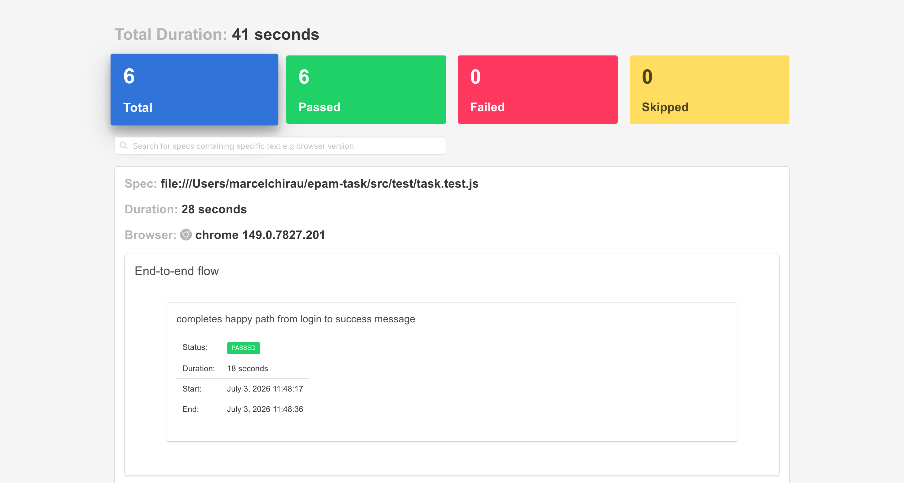
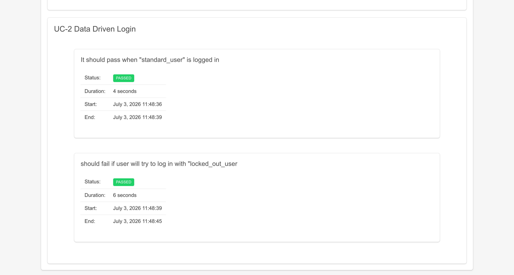
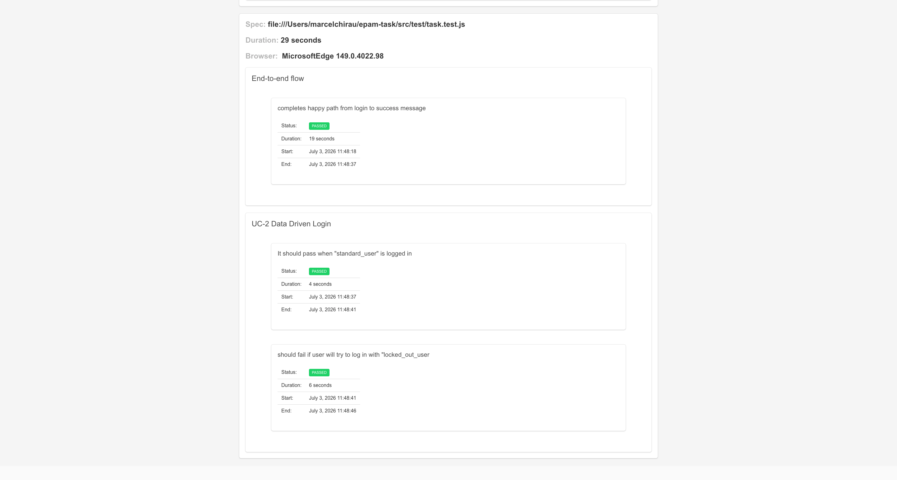

# "End-to-End" Flow
An end to end automated test, user logs in, adds a product in the cart, navigates to cart and checks it's existence in the cart.
Then proceeds to checkout, fills in the info form like first name, last name and etc, completes the checkout and validates the success message.

## Task Description
"End-to-End" Flow

* **Focus**:Happy path execution and checkout logic.
* **Launch URL**:[https://www.saucedemo.com/](https://www.saucedemo.com/)
* **UC-1 Checkout Flow**:
> Login with standard_user.  
> Add a specific product to the cart (parametrize the product name,e.g., "Sauce Labs Backpack").  
> Navigate to the Cart and validate the item is present.  
> Proceed to Checkout.  
> Fill in the Information from (First name, Last Name, Zip).  
> Complete the checkout and validate the success message:"Thank you for your order!".
* **UC-2 Data Driven Login**:  
Use a Data Provider to test login with:
   1. standard_user (Should pass).
   2. locked_out_user (Should fail with specific error message).
* **Technical Requirements**:
> **Tool**: WebDriverIO.  
> **Browsers**: Chrome, Edge (Run in Parallel).  
> **Locators**: CSS Selectors.  
> **Reporting**: Generate an Allure Report (or similar HTML report) for the test run.  
* **Documentation**: Add a README.md explaining how to run the tests and generate the report.  

## Prerequisites
* Node.js 18+ (tested on v23.9.0)
* Chrome and Edge must be installed locally


### How to run and download  the test on your pc:


```bash
git clone https://github.com/MarceloChirau/epam-task.git
cd epam-task
npm install
```


### To run the test:

```bash
npm test

```
This command will run both UC-1 and UC-2.


###  To generate report:
You don't need to do anything, report is generated automatically every time you run npm test. Generated reports are stored in `src/outputTest/timeline-report.html` .
To open the report just double click on *timeline-report.html*


#### See pictures from timeline reporter:





### Click on the link to see a video of the report:
[report video](https://youtu.be/n7SEg-pQ090)