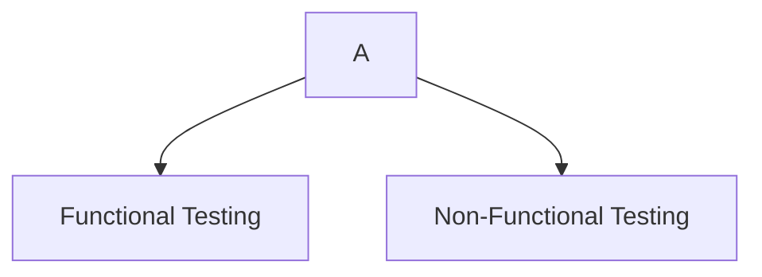
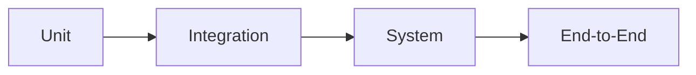

# Testing Types

## Introduction

Software testing can be divided into two broad categories:

- **Functional Testing** – verifies *what* the application does.
- **Non-Functional Testing** – verifies *how well* the application performs.




---

# Functional Testing

Functional testing verifies that the software behaves according to its functional requirements.

It answers the question:

> **"Does the application do what it is supposed to do?"**

---

# Unit Testing

## What is it?

Unit testing verifies the smallest testable part of an application (usually a function or method) in isolation.

## Purpose

- Verify business logic
- Catch bugs early
- Enable safe refactoring
- Provide fast feedback

## When to Use

During development, whenever a new function, method, or class is created.

## Example

```javascript
function add(a, b) {
    return a + b;
}

test("adds two numbers", () => {
    expect(add(2, 3)).toBe(5);
});
```

### Characteristics

- Very fast
- Independent
- Usually mocked dependencies
- Large number of tests

---

# Integration Testing

## What is it?

Integration testing verifies that multiple components work correctly together.

Instead of testing individual units, it tests their interactions.

## Purpose

Ensure communication between components.

Examples:

- API ↔ Database
- Frontend ↔ Backend
- Service ↔ External API

## When to Use

After unit testing and before system testing.

## Example

Testing whether:

```
Login Form
      ↓
REST API
      ↓
Database
```

correctly authenticates a user.

### Characteristics

- Medium speed
- Tests real integrations
- Finds communication issues

---

# System Testing

## What is it?

System testing verifies the complete, integrated application as a whole.

Everything runs together.

## Purpose

Verify that the entire system satisfies business requirements.

## When to Use

Before User Acceptance Testing.

## Example

Testing an online shopping application:

- Login
- Search products
- Add to cart
- Checkout
- Payment
- Order confirmation

Everything is tested together.

---

# End-to-End (E2E) Testing

## What is it?

End-to-End testing simulates real user behaviour from start to finish.

## Purpose

Verify complete business workflows.

## When to Use

Critical user journeys.

## Example

```
Open Website
      ↓
Login
      ↓
Browse Products
      ↓
Checkout
      ↓
Payment
      ↓
Logout
```

Example (Playwright):

```javascript
await page.goto("/");
await page.fill("#email", "user@test.com");
await page.click("text=Login");
await expect(page).toHaveURL("/dashboard");
```

### Characteristics

- Slow
- High confidence
- Expensive to maintain

---

# Smoke Testing

## What is it?

Smoke testing is a small collection of tests that verifies whether the most critical functionality works after a new build.

Think of it as a **health check**.

## Purpose

Determine if the build is stable enough for further testing.

## When to Use

- After every deployment
- Before regression testing
- Before exploratory testing

## Example

Check that:

- Application starts
- Login works
- Homepage loads
- Database connection works

If these fail, deeper testing is usually postponed.

---

# Sanity Testing

## What is it?

Sanity testing verifies that a specific change or bug fix works as expected.

It has a narrower scope than smoke testing.

## Purpose

Quickly validate recent changes.

## When to Use

After fixing a bug or implementing a small feature.

## Example

A developer fixes password reset.

Sanity test only verifies:

- Password reset
- Email received
- New password works

No need to test the entire application.

---

# Regression Testing

## What is it?

Regression testing ensures that recent code changes have not broken existing functionality.

## Purpose

Detect unintended side effects.

## When to Use

After:

- Bug fixes
- New features
- Refactoring
- Major updates

## Example

A coupon feature is added.

Regression tests verify that:

- Login still works
- Payments still work
- Search still works
- Orders still work

---

# Acceptance Testing

## What is it?

Acceptance testing verifies that the software satisfies business and customer requirements.

Usually performed before release.

## Purpose

Determine whether the application is ready for production.

## When to Use

Near the end of development.

## Example

Client verifies:

- Business requirements
- User workflows
- Expected functionality

Types include:

- User Acceptance Testing (UAT)
- Alpha Testing
- Beta Testing

---

# Non-Functional Testing

Non-functional testing evaluates qualities of the system rather than specific features.

It answers:

> **"How well does the application perform?"**

---

# Performance Testing

## What is it?

Performance testing measures speed, responsiveness, and stability.

## Purpose

Identify performance bottlenecks.

## When to Use

Before production or after major performance-related changes.

## Example

Measure:

- Response time
- CPU usage
- Memory usage

---

# Load Testing

## What is it?

Load testing checks system behaviour under expected user traffic.

## Purpose

Verify the application performs well under normal load.

## When to Use

Before production launches or expected traffic increases.

## Example

```
Expected users:
5,000

Application should remain responsive.
```

---

# Stress Testing

## What is it?

Stress testing pushes the system beyond its expected limits.

## Purpose

Determine breaking points and recovery behaviour.

## When to Use

High-risk systems or capacity planning.

## Example

Expected users:

5,000

Stress test:

50,000 users

Observe:

- Crashes
- Recovery
- Error handling

---

# Security Testing

## What is it?

Security testing verifies that the application protects data and resists attacks.

## Purpose

Identify vulnerabilities.

## When to Use

Throughout development and before release.

## Example

Verify protection against:

- SQL Injection
- Cross-Site Scripting (XSS)
- Broken Authentication
- Sensitive data exposure

---

# Accessibility Testing

## What is it?

Accessibility testing ensures that people with disabilities can use the application.

## Purpose

Meet accessibility standards and improve usability for everyone.

## When to Use

Throughout development and before release.

## Example

Verify:

- Keyboard navigation
- Screen reader compatibility
- Colour contrast
- Alternative text for images
- Focus indicators

---

# Usability Testing

## What is it?

Usability testing evaluates how easy and intuitive the application is to use.

## Purpose

Improve the user experience.

## When to Use

Before release or during UX improvements.

## Example

Observe users completing tasks such as:

- Registering an account
- Completing a purchase
- Finding information

Record where users struggle and use that feedback to improve the interface.

---

# Comparison

| Testing Type | Scope | Speed | Purpose |
|--------------|-------|-------|---------|
| Unit | Single function/class | Very Fast | Verify isolated logic |
| Integration | Multiple components | Fast | Verify interactions |
| System | Whole application | Medium | Verify complete system |
| End-to-End | Full user journey | Slow | Verify real workflows |
| Smoke | Critical features | Very Fast | Check build stability |
| Sanity | Specific change | Very Fast | Validate a bug fix or feature |
| Regression | Existing functionality | Slow | Ensure nothing broke |
| Acceptance | Business requirements | Medium | Approve release |

---
# Mermaid Overview



Testing generally progresses from small, isolated components to complete user workflows.

---

# Common Interview Questions

### What is the difference between Smoke and Sanity Testing?

**Smoke Testing**
- Checks whether the application is stable enough for testing.
- Covers the most critical features.
- Performed on every new build.

**Sanity Testing**
- Verifies a specific bug fix or small change.
- Has a narrow scope.
- Confirms recent changes behave as expected.

---

### What is the difference between System and End-to-End Testing?

**System Testing**
- Tests the complete application as a whole.
- Focuses on functional requirements.

**End-to-End Testing**
- Simulates a real user's journey through the application.
- Focuses on business workflows from start to finish.

---

### Why are End-to-End tests slower?

Because they interact with:

- Browsers
- Networks
- Databases
- APIs
- External services

All of these increase execution time compared to isolated unit tests.

---

# Key Takeaways

- Functional testing verifies **what** the application does.
- Non-functional testing verifies **how well** it does it.
- Unit tests are the fastest and most isolated.
- Integration tests validate interactions between components.
- System tests evaluate the complete application.
- End-to-end tests simulate real user behaviour.
- Smoke tests confirm a build is stable enough for further testing.
- Sanity tests validate a specific fix or change.
- Regression tests ensure existing functionality still works after changes.
- Acceptance testing confirms the software meets business requirements and is ready for release.


### Functional

- Unit
- Integration
- System
- End-to-End
- Smoke
- Sanity
- Regression
- Acceptance

### Non-functional

- Performance
- Load
- Stress
- Security
- Accessibility
- Usability

