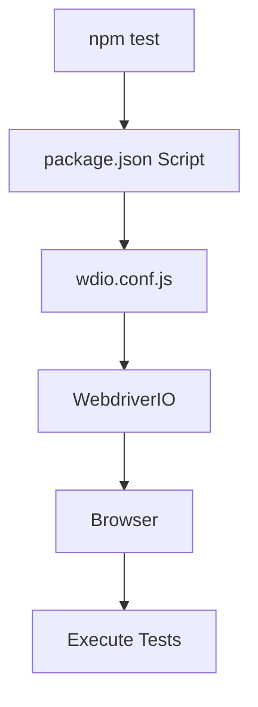

# Configuration

## Introduction

Configuration files define how a project is built, executed, tested, formatted, and maintained.

Instead of changing application code, developers configure the project's behaviour using dedicated configuration files.

Common configuration files include:

- package.json
- .env
- wdio.conf.js
- playwright.config.ts
- Babel configuration
- TypeScript configuration
- ESLint configuration
- Prettier configuration

---

# package.json

## What is it?

`package.json` is the main configuration file for every Node.js project.

It contains:

- Project information
- Dependencies
- Scripts
- Project metadata
- Package settings

Without it, npm cannot properly manage the project.

---

## Example

```json
{
  "name": "automation-framework",
  "version": "1.0.0",
  "scripts": {
    "test": "wdio run wdio.conf.js",
    "lint": "eslint .",
    "format": "prettier --write ."
  },
  "dependencies": {
    "@faker-js/faker": "^10.0.0"
  },
  "devDependencies": {
    "@wdio/cli": "^9.0.0"
  }
}
```

---

## Important Sections

### scripts

Custom terminal commands.

```bash
npm test

npm run lint

npm run format
```

---

### dependencies

Packages required by the application.

Example:

```json
"dependencies": {
    "axios": "^1.0.0"
}
```

---

### devDependencies

Packages only needed during development.

Example:

```json
"devDependencies": {
    "@wdio/cli": "...",
    "eslint": "...",
    "prettier": "..."
}
```

---

# .env

## What is it?

`.env` stores environment variables.

Typical values include:

- URLs
- Usernames
- Passwords
- API Keys
- Tokens

Never commit sensitive `.env` files to Git.

---

## Example

```text
BASE_URL=https://staging.example.com

USERNAME=testUser

PASSWORD=myPassword123
```

---

## Accessing Variables

```javascript
process.env.BASE_URL

process.env.USERNAME
```

---

## Why use .env?

Instead of:

```javascript
browser.url("https://staging.example.com");
```

Use:

```javascript
browser.url(process.env.BASE_URL);
```

Now changing environments requires no code changes.

---

# wdio.conf.js

## What is it?

`wdio.conf.js` is the main configuration file for a WebdriverIO project.

It controls how WebdriverIO runs your automated tests.

Think of it as the "brain" of the framework.

Everything starts here.

---

## Responsibilities

- Test execution
- Browser configuration
- Test locations
- Reporters
- Services
- Hooks
- Timeouts
- Parallel execution
- Capabilities

---

## Typical Structure

```javascript
export const config = {

    runner: "local",

    specs: [
        "./test/specs/**/*.js"
    ],

    maxInstances: 5,

    capabilities: [{
        browserName: "chrome"
    }],

    logLevel: "info",

    baseUrl: "https://example.com",

    waitforTimeout: 10000,

    framework: "mocha",

    reporters: ["spec"],

    services: ["chromedriver"]

};
```

---

# Important Configuration Options

## runner

Determines where tests execute.

```javascript
runner: "local"
```

or

```javascript
runner: "browser"
```

---

## specs

Defines which test files to execute.

```javascript
specs: [
    "./test/specs/**/*.js"
]
```

---

## exclude

Ignore specific tests.

```javascript
exclude: [
    "./test/specs/experimental/*.js"
]
```

---

## capabilities

Defines browser configuration.

Example:

```javascript
capabilities: [
    {
        browserName: "chrome"
    }
]
```

Multiple browsers:

```javascript
capabilities: [
    { browserName: "chrome" },
    { browserName: "firefox" }
]
```

---

## maxInstances

Maximum number of tests running in parallel.

```javascript
maxInstances: 5
```

---

## baseUrl

Base application URL.

```javascript
baseUrl: "https://example.com"
```

Instead of

```javascript
browser.url("https://example.com/login");
```

you can write

```javascript
browser.url("/login");
```

---

## waitforTimeout

Default timeout for wait commands.

```javascript
waitforTimeout: 10000
```

---

## framework

Testing framework.

```javascript
framework: "mocha"
```

Possible values:

- mocha
- jasmine
- cucumber

---

## reporters

Generate reports.

Example:

```javascript
reporters: [
    "spec"
]
```

Popular reporters:

- spec
- allure
- junit
- dot

---

## services

Services simplify browser management.

Example:

```javascript
services: [
    "chromedriver"
]
```

Other examples:

- selenium-standalone
- browserstack
- sauce

---

## Hooks

Run code before or after test execution.

Example:

```javascript
before() {

}

beforeTest() {

}

afterTest() {

}

after() {

}
```

Common hooks:

- beforeSession
- before
- beforeSuite
- beforeTest
- afterTest
- afterSuite
- after

---

# Execution Flow



---

# playwright.config.ts

## What is it?

The main configuration file for Playwright projects.

Equivalent to `wdio.conf.js` in WebdriverIO.

---

## Example

```typescript
import { defineConfig } from '@playwright/test';

export default defineConfig({

    testDir: './tests',

    timeout: 30000,

    retries: 2,

    use: {

        baseURL: 'https://example.com',

        browserName: 'chromium',

        headless: true

    }

});
```

---

## Common Options

- testDir
- timeout
- retries
- workers
- reporter
- projects
- use
- baseURL
- trace
- screenshot
- video

---

# Babel

## What is Babel?

Babel is a JavaScript compiler.

It converts modern JavaScript into code that older browsers or environments understand.

Example:

Modern JavaScript

```javascript
const add = (a, b) => a + b;
```

can be transformed into older JavaScript compatible with legacy environments.

---

## When is Babel Used?

- Older browsers
- Legacy projects
- React
- Modern JavaScript features

---

# TypeScript

## What is TypeScript?

TypeScript is JavaScript with static typing.

It helps detect errors before runtime.

Example:

```typescript
function add(a: number, b: number): number {
    return a + b;
}
```

Benefits:

- Better IntelliSense
- Type checking
- Easier refactoring
- Improved maintainability

---

# ESLint

## What is ESLint?

ESLint analyses source code and identifies problems.

Examples:

- Unused variables
- Missing semicolons
- Incorrect formatting
- Possible bugs

Example:

```javascript
const name = "John"
```

ESLint:

```
Missing semicolon.
```

---

# Prettier

## What is Prettier?

Prettier automatically formats code.

Instead of manually aligning everything, it enforces a consistent coding style.

Example before:

```javascript
const user={name:"John",age:20}
```

After formatting:

```javascript
const user = {
    name: "John",
    age: 20,
};
```

---

# ESLint vs Prettier

| ESLint | Prettier |
|----------|-----------|
| Finds code issues | Formats code |
| Prevents bugs | Improves readability |
| Configurable rules | Opinionated formatting |
| Can enforce best practices | Doesn't detect logic errors |

They are often used together.

---

# Common Interview Questions

### What is package.json?

The main configuration file of a Node.js project. It stores project metadata, dependencies, and scripts.

---

### Why use .env?

To separate configuration and secrets from application code, making it easier to switch between environments and avoid exposing sensitive information.

---

### What is wdio.conf.js?

The central configuration file for WebdriverIO. It defines how tests are executed, which browsers are used, what services and reporters are enabled, and other framework settings.

---

### What is the difference between ESLint and Prettier?

ESLint analyses code quality and potential errors, while Prettier automatically formats code to a consistent style.

---

### Why use TypeScript?

TypeScript provides static typing, better tooling, and catches many errors during development instead of at runtime.

---

# Key Takeaways

- `package.json` is the heart of every Node.js project.
- `.env` stores environment-specific configuration and secrets.
- `wdio.conf.js` controls every aspect of a WebdriverIO test run.
- `playwright.config.ts` serves the same role for Playwright.
- Babel enables modern JavaScript to run in older environments.
- TypeScript adds static typing for safer, more maintainable code.
- ESLint improves code quality by detecting issues.
- Prettier ensures consistent code formatting across the project.