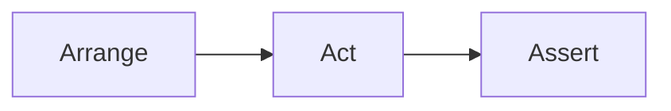

# Best Practices

## Introduction

Writing automated tests is not only about making them pass. Good tests should also be:

- Readable
- Reliable
- Maintainable
- Independent
- Fast
- Easy to debug

Following best practices reduces flaky tests, improves maintainability, and increases confidence in the automation suite.

---

# AAA Pattern (Arrange, Act, Assert)

The **AAA Pattern** is one of the most common ways to structure a test.



---

## Arrange

Prepare everything needed before the test executes.

Examples:

- Open the application
- Create test data
- Log in
- Navigate to a page

```javascript
await browser.url("/login");

const email = faker.internet.email();
//or 
// const password=faker.internet.password();
const password = "Password123!";
```

---

## Act

Perform the action being tested.

```javascript
await $("#email").setValue(email);
await $("#password").setValue(password);
await $("#loginBtn").click();
```

---

## Assert

Verify that the expected result occurred.

```javascript
await expect($("#dashboard")).toBeDisplayed();
```

---

## Complete Example

```javascript
it("should login successfully", async () => {

    // Arrange
    await browser.url("/login");

    // Act
    await $("#email").setValue("user@test.com");
    await $("#password").setValue("Password123");
    await $("#loginBtn").click();

    // Assert
    await expect($("#dashboard")).toBeDisplayed();

});
```

---

# DRY (Don't Repeat Yourself)

## What is it?

Avoid duplicating code.

If the same logic appears multiple times, move it into a reusable function.

---

## Bad

```javascript
await $("#email").setValue(email);
await $("#password").setValue(password);
await $("#loginBtn").click();
```

Repeated in ten different tests.

---

## Better

```javascript
await loginPage.login(email, password);
```

The implementation exists only once.

Benefits:

- Easier maintenance
- Less duplication
- Cleaner tests

---

# SOLID Principles

SOLID consists of five object-oriented design principles that improve maintainability.

Although created for software development, several principles apply directly to test automation.

---

## S — Single Responsibility Principle

A class should have one responsibility.

Good:

```text
LoginPage

↓

Only login-related actions
```

Bad:

```text
LoginPage

↓

Login

Checkout

Orders

Payments
```

---

## O — Open/Closed Principle

Classes should be open for extension but closed for modification.

Instead of changing existing code, extend it.

---

## L — Liskov Substitution Principle

Derived classes should be replaceable without changing behaviour.

Less common in UI automation interviews.

---

## I — Interface Segregation Principle

Avoid large interfaces.

Keep responsibilities focused.

---

## D — Dependency Inversion Principle

Depend on abstractions rather than concrete implementations.

Example:

Inject API clients or database helpers instead of creating them directly.

---

# Write Readable Tests

Tests should read almost like English.

Good:

```javascript
await loginPage.login(user);
await expect(homePage.header).toBeDisplayed();
```

Bad:

```javascript
await $("input:nth-child(2)").setValue("john");
await $("button:nth-child(5)").click();
```

Readable tests are easier to maintain.

---

# Independent Tests

Every test should run successfully on its own.

Good tests:

- Create their own data
- Clean up after themselves
- Never depend on execution order

Bad:

```text
Test A creates user

↓

Test B edits user

↓

Test C deletes user
```

If Test A fails, the others fail too.

---

# Use Explicit Waits

Instead of waiting a fixed amount of time, wait for a specific condition.

Good:

```javascript
await $("#loginBtn").waitForClickable();

await $("#dashboard").waitForDisplayed();
```

Bad:

```javascript
await browser.pause(5000);
```

Explicit waits make tests more reliable and faster.

---

# Use Stable Selectors

Choose selectors that are unlikely to change.

Best:

```javascript
$('[data-testid="login-button"]')
```

Good:

```javascript
$("#loginBtn")
```

Avoid:

```javascript
$("div:nth-child(4)")
```

or

```javascript
$(".css-1a2b3c")
```

Stable selectors reduce flaky tests.

---

# Avoid Fixed Sleeps

Avoid:

```javascript
await browser.pause(3000);
```

Problems:

- Slow tests
- Flaky tests
- Wasted execution time

Instead:

```javascript
await $("#success").waitForDisplayed();
```

Rule:

> Wait for conditions, not for time.

---

# Naming Conventions

Use descriptive names.

Good test names:

```javascript
should login with valid credentials

should display validation error for invalid password

should add product to shopping cart
```

Good method names:

```javascript
login()

logout()

createUser()

deleteProduct()
```

Bad names:

```javascript
test1()

click()

run()

abc()
```

Good names explain intent.

---

# Logging

Logs make debugging much easier.

Example:

```javascript
console.log("Creating user...");

console.log("Logging in...");

console.log("Checkout completed.");
```

Better yet, use a proper logger for larger projects.

Log:

- Test steps
- Important values
- API responses (when useful)
- Errors

Avoid excessive logging that makes reports noisy.

---

# Take Screenshots on Failure

Screenshots help diagnose UI failures.

Example:

```javascript
afterTest(async function(test, context, result) {

    if (!result.passed) {

        await browser.saveScreenshot(
            "./screenshots/error.png"
        );

    }

});
```

Benefits:

- Easier debugging
- Better reports
- Useful CI/CD artifacts

Many frameworks (WebdriverIO, Playwright) can capture screenshots automatically on failure.

---

# Additional Best Practices

## Keep Tests Small

Each test should verify one behaviour.

Good:

```text
Login succeeds.
```

Bad:

```text
Login

↓

Checkout

↓

Payment

↓

Logout

↓

Profile Update
```

If it fails, finding the cause becomes difficult.

---

## Use the Page Object Model (POM)

Separate page interactions from test logic.

Instead of:

```javascript
await $("#email").setValue(...);
```

Use:

```javascript
await loginPage.enterEmail(...);
```

This improves readability and maintainability.

---

## Avoid Hardcoded Test Data

Bad:

```javascript
"user@test.com"
```

Better:

```javascript
faker.internet.email()
```

Or load data from fixtures:

```javascript
users.json
```

---

## Clean Up Test Data

If a test creates data:

- Delete it afterwards
- Or use isolated environments

Leaving test data behind can affect future test runs.

---

# Common Interview Questions

### Why should tests be independent?

Independent tests can run in any order, in parallel, and without relying on the outcome of other tests. This improves reliability and makes failures easier to diagnose.

---

### Why avoid `browser.pause()`?

Fixed delays slow down execution and make tests flaky because they wait for a fixed amount of time instead of waiting for the application to reach the required state.

---

### What makes a good selector?

A good selector is stable, unique, and resistant to UI changes. Attributes such as `data-testid` are generally preferred over CSS classes or element positions.

---

### Why use the AAA Pattern?

It separates setup, execution, and verification, making tests easier to read, understand, and maintain.

---

### Why use the Page Object Model?

It centralises page interactions, reduces duplication, and simplifies maintenance when the UI changes.

---

# Key Takeaways

- Follow the AAA pattern: **Arrange → Act → Assert**.
- Avoid repeating code by applying the **DRY** principle.
- Apply relevant **SOLID** principles to page objects and utilities.
- Keep tests readable and focused on a single behaviour.
- Make tests independent so they can run in any order.
- Prefer explicit waits over fixed delays.
- Use stable selectors such as `data-testid`.
- Give tests and methods meaningful names.
- Log important events to simplify debugging.
- Capture screenshots when tests fail.
- Use the Page Object Model and reusable helper methods to improve maintainability.