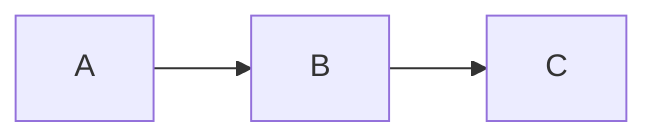

````markdown
# Mermaid Flowchart Cheat Sheet

This guide covers the core Mermaid **flowchart** syntax and features.

---

# 1. Graph Declaration

Mermaid flowcharts can begin with either `graph` or `flowchart`.


or


Both are equivalent.

---

# 2. Flowchart Orientation

| Direction | Meaning |
|-----------|---------|
| `TB` | Top to Bottom |
| `TD` | Top Down (same as TB) |
| `BT` | Bottom to Top |
| `LR` | Left to Right |
| `RL` | Right to Left |

Example:



---

# 3. Node Shapes

### Rectangle

```mermaid
A[Rectangle]
```

---

### Rounded Rectangle

```mermaid
A(Rounded)
```

---

### Stadium

```mermaid
A([Stadium])
```

---

### Circle

```mermaid
A((Circle))
```

---

### Double Circle

```mermaid
A(((Double Circle)))
```

---

### Diamond (Decision)

```mermaid
A{Decision}
```

---

### Hexagon

```mermaid
A{{Hexagon}}
```

---

### Parallelogram

```mermaid
A[/Input/]
```

or

```mermaid
A[\Output\]
```

---

### Trapezoid

```mermaid
A[/Trapezoid\]
```

---

### Inverted Trapezoid

```mermaid
A[\Trapezoid/]
```

---

### Cylinder (Database)

```mermaid
A[(Database)]
```

---

# 4. Links Between Nodes

### Arrow

```mermaid
A --> B
```

---

### Open Link

```mermaid
A --- B
```

---

### Thick Arrow

```mermaid
A ==> B
```

---

### Dotted Arrow

```mermaid
A -.-> B
```

---

### Dotted Link

```mermaid
A -.- B
```

---

### Thick Link

```mermaid
A === B
```

---

### Link with Text

```mermaid
A -->|Yes| B
A -->|No| C
```

---

### Multiple Links

```mermaid
A --> B
A --> C
B --> D
C --> D
```

---

# 5. Special Characters that Break Syntax

Characters such as

```
#
%
&
<
>
"
'
(
)
[
]
```

can sometimes interfere with parsing.

Use quotes when necessary:

```mermaid
A["Price > £100"]
```

or HTML entities:

```
<  ->  &lt;
>  ->  &gt;
&  ->  &amp;
```

---

# 6. Subgraphs

```mermaid
flowchart LR

subgraph Frontend
    A
    B
end

subgraph Backend
    C
    D
end

A --> C
B --> D
```

---

# 7. Direction in Subgraphs

Each subgraph may have its own direction.

```mermaid
flowchart LR

subgraph API
direction TB

A
B
C

end

X --> A
```

Supported directions:

- LR
- RL
- TB
- BT

---

# 8. Interaction

Clickable nodes

```mermaid
flowchart TD

A[Homepage]

click A "https://example.com"
```

Tooltip

```mermaid
flowchart TD

A[Home]

click A "https://example.com" "Visit Homepage"
```

JavaScript callback

```mermaid
flowchart TD

click A callback
```

---

# 9. Styling and Classes

## Individual Style

```mermaid
flowchart TD

A

style A fill:#90EE90,stroke:#333,stroke-width:2px
```

---

## Define a Class

```mermaid
flowchart TD

classDef success fill:#90EE90,stroke:#333,color:#000

A
B

class A,B success
```

---

## Multiple Classes

```mermaid
classDef warning fill:#FFD966
classDef error fill:#F4CCCC

class A warning
class B error
```

---

# 10. Font Awesome Icons

Enable Font Awesome support.

```mermaid
flowchart TD

A["fa:fa-user User"]
B["fa:fa-database Database"]

A --> B
```

Example icons:

- fa-user
- fa-home
- fa-cog
- fa-server
- fa-database
- fa-envelope

---

# 11. Graph Declarations with Spaces (No Semicolons)

Mermaid allows clean formatting without semicolons.

```mermaid
flowchart LR

A --> B

B --> C

C --> D
```

Multiple nodes may also be declared naturally:

```mermaid
flowchart TD

Start --> Login

Login --> Dashboard

Dashboard --> Logout
```

---

# 12. Configuration

Configuration is placed at the top.

```mermaid
%%{
init: {
    "theme": "default"
}
}%%

flowchart LR

A --> B
```

---

## Theme

```json
{
    "theme": "default"
}
```

Other themes:

- default
- forest
- dark
- neutral
- base

---

## Curve Type

```json
{
    "flowchart": {
        "curve": "basis"
    }
}
```

Options include:

- linear
- basis
- cardinal
- step
- monotoneX

---

## HTML Labels

```json
{
    "flowchart": {
        "htmlLabels": true
    }
}
```

---

## Security Level

```json
{
    "securityLevel": "loose"
}
```

Useful when using:

- click
- JavaScript callbacks
- HTML labels

---

# Complete Example

```mermaid
%%{
init:{
"theme":"forest"
}
}%%

flowchart LR

subgraph Frontend
direction TB
A[User]
B(Login)
end

subgraph Backend
direction TB
C[(Database)]
D{Authenticated?}
end

A --> B
B --> D
D -->|Yes| C
D -->|No| E[Access Denied]

style E fill:#F4CCCC

classDef success fill:#90EE90

class C success
```

---

# Summary

- `graph` and `flowchart` are interchangeable.
- Choose one of four layout directions (`TB`, `BT`, `LR`, `RL`).
- Use different node shapes to represent different concepts.
- Connect nodes with arrows, dotted lines, or thick lines.
- Organise complex diagrams using `subgraph`.
- Apply styling with `style` or reusable `classDef`.
- Add icons with Font Awesome.
- Configure themes and rendering using the `init` block.
````
